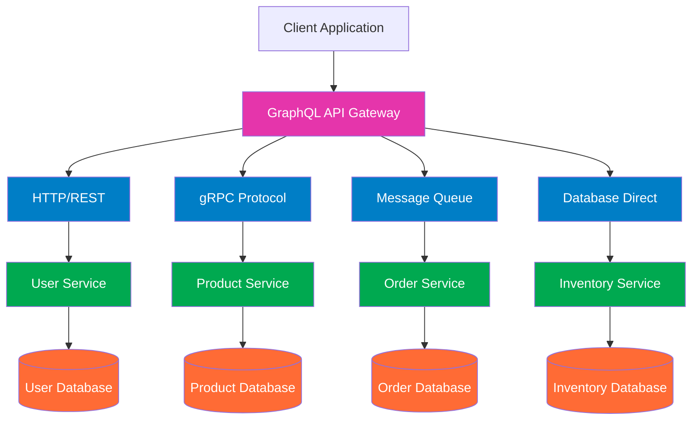

# STDT-F-2-UTS-
Sistem Terdistribusi Dan Terdesentralisasi IF-2
## 1. Jelaskan teorema CAP dan BASE dan keterkaitan keduanya. Jelaskan menggunakan contoh yang pernah anda gunakan?
   - Teorema CAP menetapkan batas teoritis (trade-off antara C, A, dan P), sedangkan Prinsip BASE adalah strategi praktis (memilih AP) untuk membangun sistem yang beroperasi di dalam batas-batas tersebut dengan mengutamakan ketersediaan dan toleransi partisi.
   - Pencatatan saldo e-wallet: Jika memilih CP, saat jaringan antar server terputus, server tidak berani melayani transaksi sebelum yakin semua server punya data terbaru. Transaksi mungkin ditolak untuk sementara. Konsisten terjaga, tapi availability hilang.

## 2. Jelaskan keterkaitan antara GraphQL dengan komunikasi antar proses pada sistem terdistribusi. Buat diagramnya?
- bagaimana GraphQL bertindak sebagai perantara yang mengorkestrasi komunikasi internal antar proses (IPC) di antara microservices untuk memenuhi satu query dari client:
# Arsitektur GraphQL dalam Sistem Terdistribusi



## Diagram Arsitektur GraphQL sebagai API Gateway

```mermaid
graph TD
    %% Client Layer
    Web[Web Client] --> GraphQL
    Mobile[Mobile App] --> GraphQL
    Desktop[Desktop Client] --> GraphQL
    
    %% GraphQL Layer
    GraphQL[GraphQL API Gateway]
    
    %% Protocol Layer
    GraphQL --> HTTP[HTTP/REST]
    GraphQL --> gRPC[gRPC Protocol]
    GraphQL --> Message[Message Queue]
    GraphQL --> DB[Direct DB Access]
    
    %% Microservices Layer
    HTTP --> AuthService[Auth Service]
    HTTP --> UserService[User Service]
    gRPC --> ProductService[Product Service]
    gRPC --> InventoryService[Inventory Service]
    Message --> OrderService[Order Service]
    Message --> PaymentService[Payment Service]
    DB --> ReportService[Report Service]
    
    %% Database Layer
    AuthService --> AuthDB[(Auth DB)]
    UserService --> UserDB[(User DB)]
    ProductService --> ProductDB[(Product DB)]
    InventoryService --> InventoryDB[(Inventory DB)]
    OrderService --> OrderDB[(Order DB)]
    PaymentService --> PaymentDB[(Payment DB)]
    ReportService --> DataWarehouse[(Data Warehouse)]
    
    %% Styling
    classDef clientStyle fill:#4a90e2,color:white
    classDef graphqlStyle fill:#e535ab,color:white
    classDef protocolStyle fill:#007ec6,color:white
    classDef serviceStyle fill:#00a950,color:white
    classDef dbStyle fill:#ff6b35,color:white
    
    class Web,Mobile,Desktop clientStyle
    class GraphQL graphqlStyle
    class HTTP,gRPC,Message,DB protocolStyle
    class AuthService,UserService,ProductService,InventoryService,OrderService,PaymentService,ReportService serviceStyle
    class AuthDB,UserDB,ProductDB,InventoryDB,OrderDB,PaymentDB,DataWarehouse dbStyle


